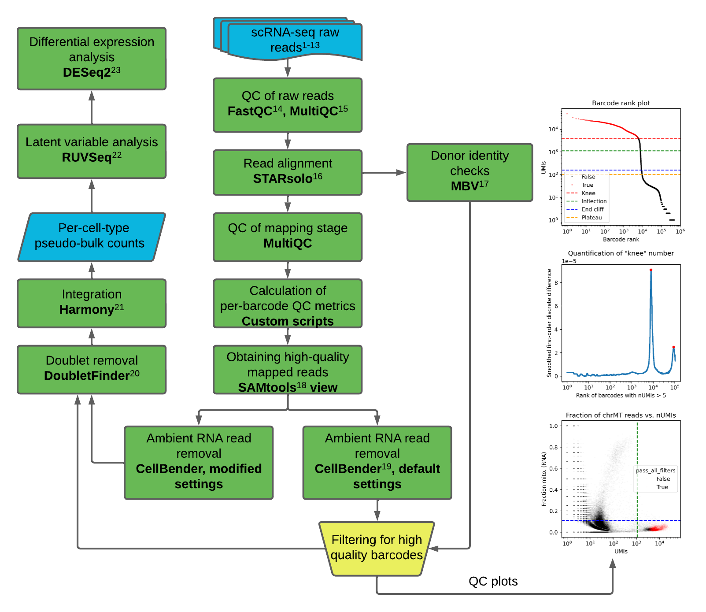

# Tiny Workflow for Testing Nextflow, Seqera, and Texera


This workflow include the steps: calculation of per-barcode QC metrics (plus generate some accompanied plots) and a tiny version of filtering for high quality barcodes.

## Repository Structure

### 1. `data/`

Contains the workflow's input data:

- `SAMN16081314_downsampled_1.7k_barcodes.tsv`
- `SAMN16081314_downsampled_1.7k.csv`
- `SAMN16081314_downsampled_1.7k_features.tsv`
- `SAMN16081314_downsampled_1.7k_matrix.mtx`

The directory does not include the BAM file because of its size. The BAM file can be downloaded from [Google Drive](https://drive.google.com/file/d/11RKblDeipJoyhFE_vF2pV1NSde1UN91c/view?usp=sharing). Please request access by emailing `vthing at umich dot edu`.

The data were downsampled from one human islet sample obtained from the following publication:

- [Nature Communications article](https://www.nature.com/articles/s41467-025-62670-5)

All upstream analyses were performed according to the methods described in the following preprint:

- [bioRxiv preprint](https://www.biorxiv.org/content/10.64898/2026.06.02.729719v3)

## 2. `scripts/`

Contains all analysis scripts and workflow configuration files:

- **`barcode_downsample.R.ipynb`**  
  Notebook showing how barcodes were selected. Included for completeness.

- **`bin/*`**  
  Helper scripts. Each script can technically be broken down into a small Texera workflow.

- **`dag-20260817-64490985.html`**  
  Nextflow-generated directed acyclic graph (DAG) describing the workflow.

- **`library-config.json`**  
  Configuration file describing the input files.

- **`main.nf`**  
  Nextflow workflow definition.

- **`nextflow.config`**  
  Nextflow configuration file.

- **`report-20260817-64490985.html`**  
  Nextflow execution report.

- **`subset-bam.slurm`**  
  Bash/SLURM script used to subset barcodes from the large BAM file. Included for completeness.

- **`trace-20260817-64490985.txt`**  
  Nextflow trace report containing execution-time and resource-usage information.

### Running the Workflow

Run Nextflow from the `scripts/` directory using a command such as:
```
## bash
~/tools/nextflow run main.nf \
  --samplesheet library-config.json \
  --results ../results/
```

## 3. `results/`

Contains the results generated by the workflow.
